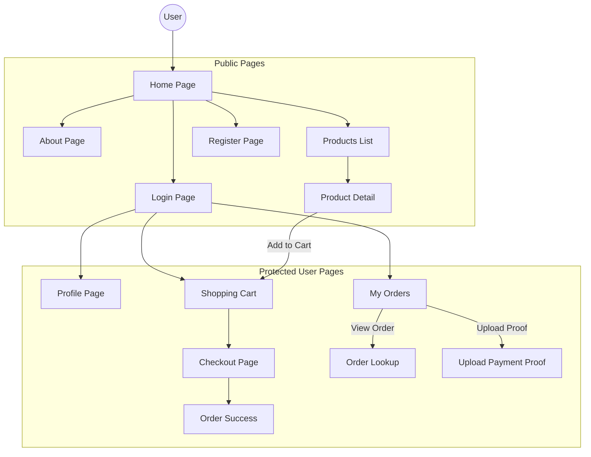
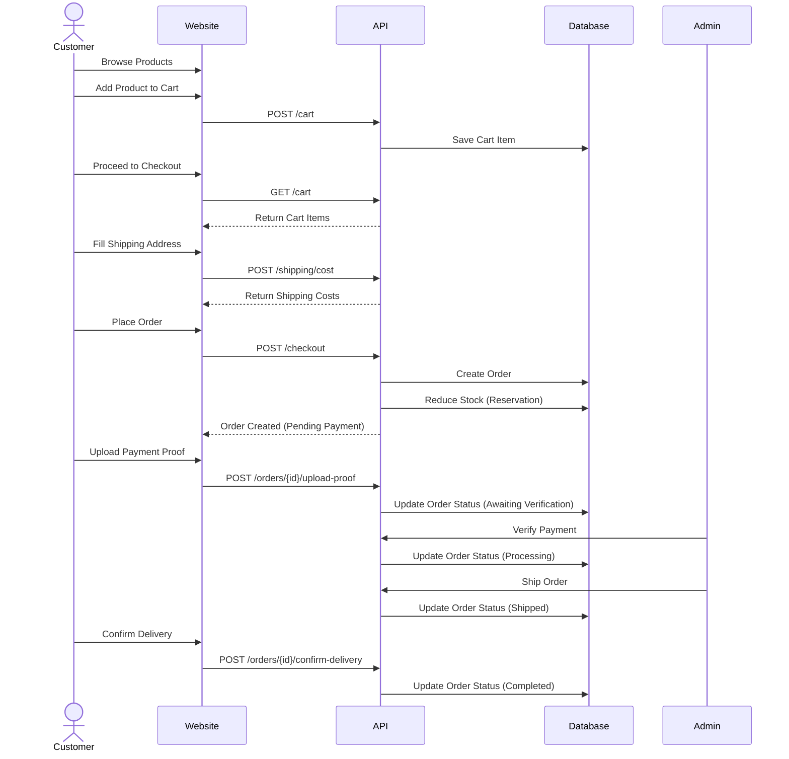
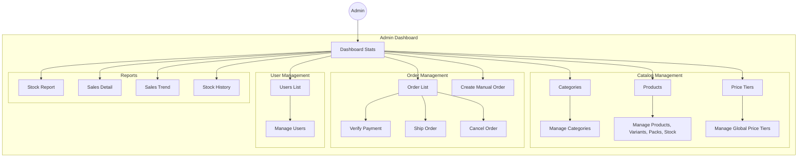

# Website Flow Diagrams

## 1. User Navigation Flow (Site Map)

```mermaid
graph TD
    User((User))

    subgraph Public Pages
        Home[Home Page]
        About[About Page]
        ProdList[Products List]
        ProdDetail[Product Detail]
        Login[Login Page]
        Register[Register Page]
    end

    subgraph Protected User Pages
        Profile[Profile Page]
        Cart[Shopping Cart]
        Checkout[Checkout Page]
        Orders[My Orders]
        OrderLookup[Order Lookup]
        UploadProof[Upload Payment Proof]
        OrderSuccess[Order Success]
    end

    User --> Home
    Home --> About
    Home --> ProdList
    Home --> Login
    Home --> Register

    ProdList --> ProdDetail

    Login --> Profile
    Login --> Cart
    Login --> Orders

    ProdDetail -->|Add to Cart| Cart
    Cart --> Checkout
    Checkout --> OrderSuccess

    Orders -->|View Order| OrderLookup
    Orders -->|Upload Proof| UploadProof
```

## 2. Purchasing Process Flow

```mermaid
sequenceDiagram
    actor Customer
    participant Frontend as Website
    participant Backend as API
    participant DB as Database
    participant Admin

    Customer->>Frontend: Browse Products
    Customer->>Frontend: Add Product to Cart
    Frontend->>Backend: POST /cart
    Backend->>DB: Save Cart Item

    Customer->>Frontend: Proceed to Checkout
    Frontend->>Backend: GET /cart
    Backend-->>Frontend: Return Cart Items

    Customer->>Frontend: Fill Shipping Address
    Frontend->>Backend: POST /shipping/cost
    Backend-->>Frontend: Return Shipping Costs

    Customer->>Frontend: Place Order
    Frontend->>Backend: POST /checkout
    Backend->>DB: Create Order
    Backend->>DB: Reduce Stock (Reservation)
    Backend-->>Frontend: Order Created (Pending Payment)

    Customer->>Frontend: Upload Payment Proof
    Frontend->>Backend: POST /orders/{id}/upload-proof
    Backend->>DB: Update Order Status (Awaiting Verification)

    Admin->>Backend: Verify Payment
    Backend->>DB: Update Order Status (Processing)

    Admin->>Backend: Ship Order
    Backend->>DB: Update Order Status (Shipped)

    Customer->>Frontend: Confirm Delivery
    Frontend->>Backend: POST /orders/{id}/confirm-delivery
    Backend->>DB: Update Order Status (Completed)
```

## 3. Admin Management Flow

```mermaid
graph TD
    Admin((Admin))

    subgraph Admin Dashboard
        Dash[Dashboard Stats]

        subgraph Catalog Management
            Cats[Categories]
            Prods[Products]
            PriceTiers[Price Tiers]

            CatsCRUD[Manage Categories]
            ProdsCRUD[Manage Products, Variants, Packs, Stock]
            PriceTiersCRUD[Manage Global Price Tiers]
        end

        subgraph Order Management
            OrderList[Order List]
            ManualOrder[Create Manual Order]

            Verify[Verify Payment]
            Ship[Ship Order]
            Cancel[Cancel Order]
        end

        subgraph User Management
            UserList[Users List]
            UserCRUD[Manage Users]
        end

        subgraph Reports
            StockRep[Stock Report]
            SalesRep[Sales Detail]
            TrendRep[Sales Trend]
            StockHist[Stock History]
        end
    end

    Admin --> Dash

    Dash --> Cats
    Cats --> CatsCRUD

    Dash --> Prods
    Prods --> ProdsCRUD

    Dash --> PriceTiers
    PriceTiers --> PriceTiersCRUD

    Dash --> OrderList
    OrderList --> Verify
    OrderList --> Ship
    OrderList --> Cancel

    Dash --> ManualOrder

    Dash --> UserList
    UserList --> UserCRUD

    Dash --> StockRep
    Dash --> SalesRep
    Dash --> TrendRep
    Dash --> StockHist
```
