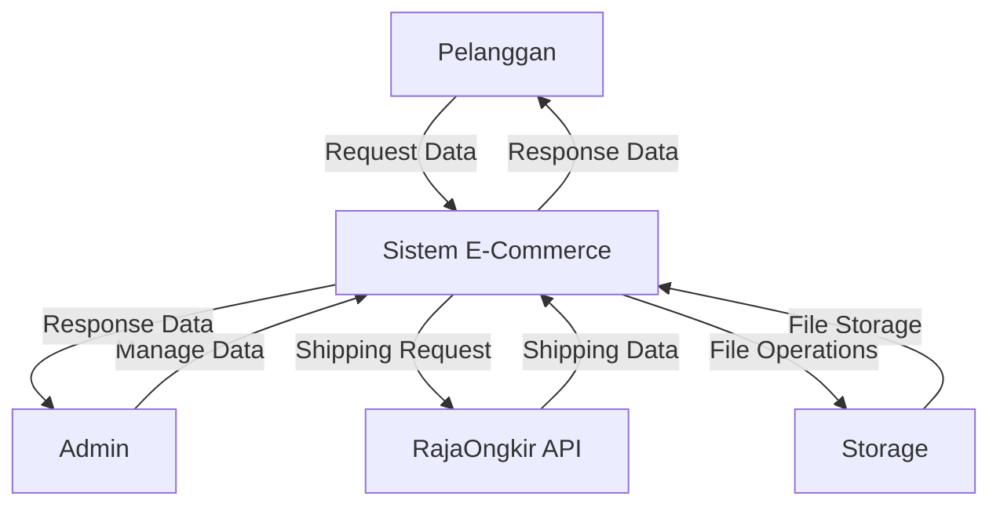
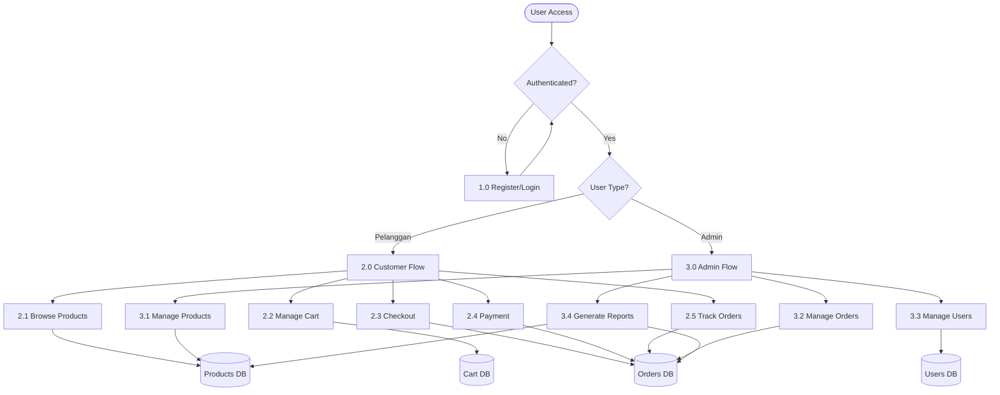
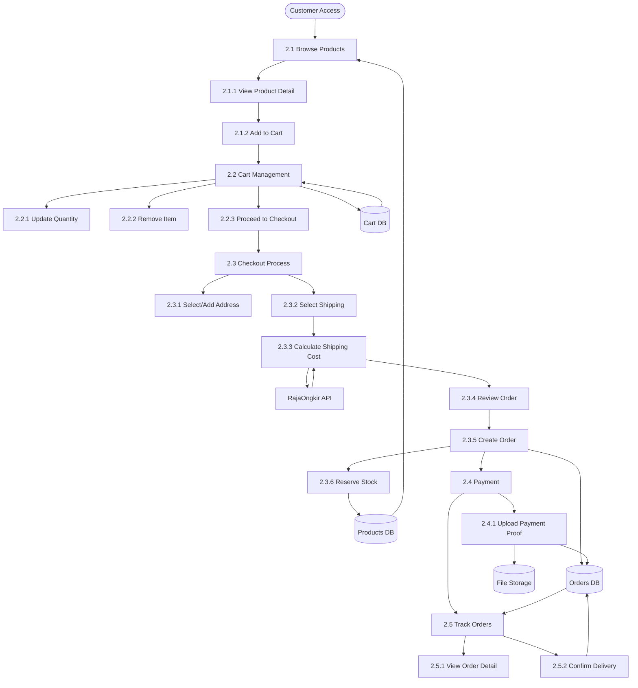
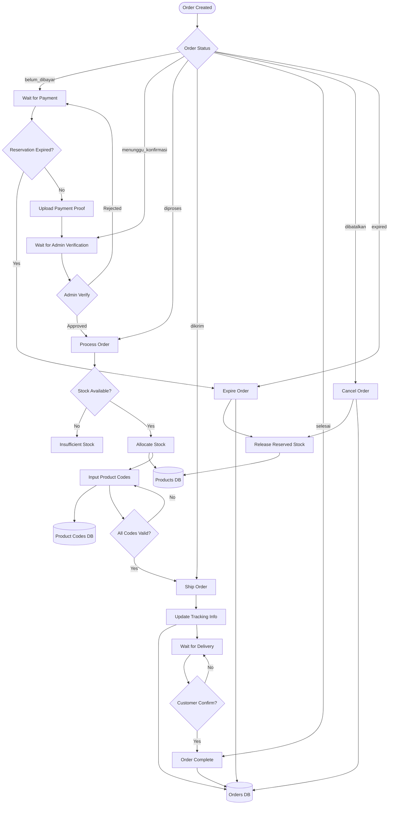
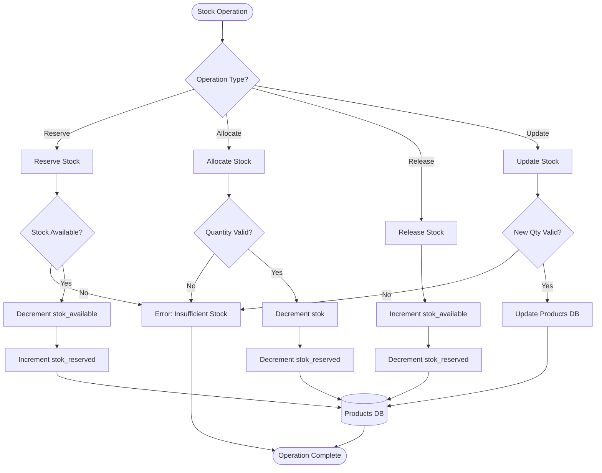

# Data Flow Diagram (DFD)

## DFD Level 0 - Context Diagram

## DFD Level 1 - Sistem Utama

## DFD Level 2 - Customer Flow Detail

## DFD Level 2 - Admin Flow Detail

```mermaid
flowchart TD
    Start([Admin Access]) --> Dashboard[3.0 Admin Dashboard]
    
    Dashboard --> ManageProducts[3.1 Product Management]
    Dashboard --> ManageOrders[3.2 Order Management]
    Dashboard --> ManageUsers[3.3 User Management]
    Dashboard --> Reports[3.4 Reports]
    
    ManageProducts --> CreateProduct[3.1.1 Create Product]
    ManageProducts --> UpdateProduct[3.1.2 Update Product]
    ManageProducts --> DeleteProduct[3.1.3 Delete Product]
    ManageProducts --> ManageCategories[3.1.4 Manage Categories]
    ManageProducts --> ManagePriceTiers[3.1.5 Manage Price Tiers]
    
    CreateProduct --> ProductsDB[(Products DB)]
    UpdateProduct --> ProductsDB
    DeleteProduct --> ProductsDB
    ManageCategories --> CategoriesDB[(Categories DB)]
    ManagePriceTiers --> PriceTiersDB[(Price Tiers DB)]
    
    ManageOrders --> ViewOrders[3.2.1 View Orders]
    ManageOrders --> CreateManualOrder[3.2.2 Create Manual Order]
    ManageOrders --> VerifyPayment[3.2.3 Verify Payment]
    ManageOrders --> InputProductCodes[3.2.4 Input Product Codes]
    ManageOrders --> ShipOrder[3.2.5 Ship Order]
    ManageOrders --> MarkDelivered[3.2.6 Mark as Delivered]
    ManageOrders --> ReleaseReservation[3.2.7 Release Expired Reservations]
    
    ViewOrders --> OrdersDB
    CreateManualOrder --> OrdersDB
    CreateManualOrder --> ReserveStock[Reserve Stock]
    ReserveStock --> ProductsDB
    VerifyPayment --> OrdersDB
    VerifyPayment --> Storage[(File Storage)]
    InputProductCodes --> ProductCodesDB[(Product Codes DB)]
    ShipOrder --> OrdersDB
    MarkDelivered --> OrdersDB
    ReleaseReservation --> OrdersDB
    ReleaseReservation --> ProductsDB
    
    ManageUsers --> ListUsers[3.3.1 List Users]
    ManageUsers --> CreateUser[3.3.2 Create User]
    ManageUsers --> UpdateUser[3.3.3 Update User]
    ManageUsers --> DeleteUser[3.3.4 Delete User]
    
    ListUsers --> UsersDB[(Users DB)]
    CreateUser --> UsersDB
    UpdateUser --> UsersDB
    DeleteUser --> UsersDB
    
    Reports --> SummaryReport[3.4.1 Summary Report]
    Reports --> SalesTrend[3.4.2 Sales Trend]
    Reports --> ProductSales[3.4.3 Product Sales]
    Reports --> ChannelPerformance[3.4.4 Channel Performance]
    Reports --> ExportReport[3.4.5 Export Report]
    
    SummaryReport --> OrdersDB
    SalesTrend --> OrdersDB
    ProductSales --> OrdersDB
    ProductSales --> ProductsDB
    ChannelPerformance --> OrdersDB
    ExportReport --> OrdersDB
    ExportReport --> ProductsDB
```

## DFD Level 3 - Order Processing Detail

## DFD Level 3 - Stock Management Detail

## Data Stores (Database Tables)

1. **Users DB**: `users` table
2. **Products DB**: `products` table
3. **Categories DB**: `kategori` table
4. **Cart DB**: `keranjang` table
5. **Orders DB**: `orders` table
6. **Order Items DB**: `order_items` table
7. **Product Codes DB**: `order_item_product_codes` table
8. **Price Tiers DB**: `harga_tingkat` table
9. **Addresses DB**: `addresses` table
10. **Storage**: File storage for images and payment proofs

## External Entities

1. **Pelanggan**: End user yang melakukan pembelian
2. **Admin**: Administrator sistem
3. **RajaOngkir API**: External API untuk shipping calculation
4. **Storage**: File storage system

