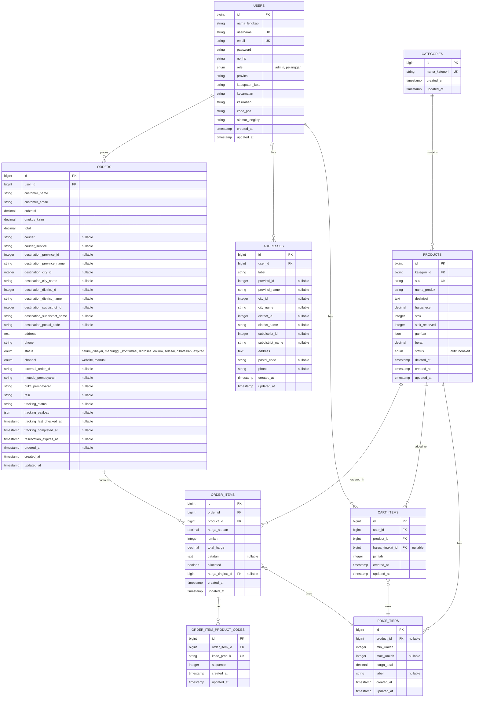

# Entity Relationship Diagram (ERD)

## ERD - Sistem E-Commerce Propolis

## Keterangan Relasi

### One-to-Many Relationships:

-   **USERS → ORDERS**: Satu user dapat memiliki banyak order
-   **USERS → ADDRESSES**: Satu user dapat memiliki banyak alamat
-   **USERS → CART_ITEMS**: Satu user dapat memiliki banyak item di keranjang
-   **CATEGORIES → PRODUCTS**: Satu kategori dapat memiliki banyak produk
-   **PRODUCTS → ORDER_ITEMS**: Satu produk dapat dipesan dalam banyak order item
-   **PRODUCTS → CART_ITEMS**: Satu produk dapat ditambahkan ke banyak keranjang
-   **ORDERS → ORDER_ITEMS**: Satu order dapat memiliki banyak order item
-   **ORDER_ITEMS → ORDER_ITEM_PRODUCT_CODES**: Satu order item dapat memiliki banyak kode produk

### Many-to-One Relationships:

-   **ORDER_ITEMS → PRICE_TIERS**: Banyak order item dapat menggunakan satu price tier
-   **CART_ITEMS → PRICE_TIERS**: Banyak cart item dapat menggunakan satu price tier
-   **PRICE_TIERS → PRODUCTS**: Price tier dapat dikaitkan dengan produk tertentu (nullable untuk global tier)

## Constraints Penting

1. **Unique Constraints:**

    - `users.username` - Unique
    - `users.email` - Unique
    - `products.sku` - Unique
    - `kategori.nama_kategori` - Unique
    - `order_item_product_codes.kode_produk` - Unique

2. **Foreign Key Constraints:**

    - Semua foreign key memiliki referential integrity
    - `order_item_product_codes.order_item_id` - CASCADE on delete

3. **Indexes:**
    - Foreign keys otomatis ter-index
    - Unique constraints otomatis ter-index
