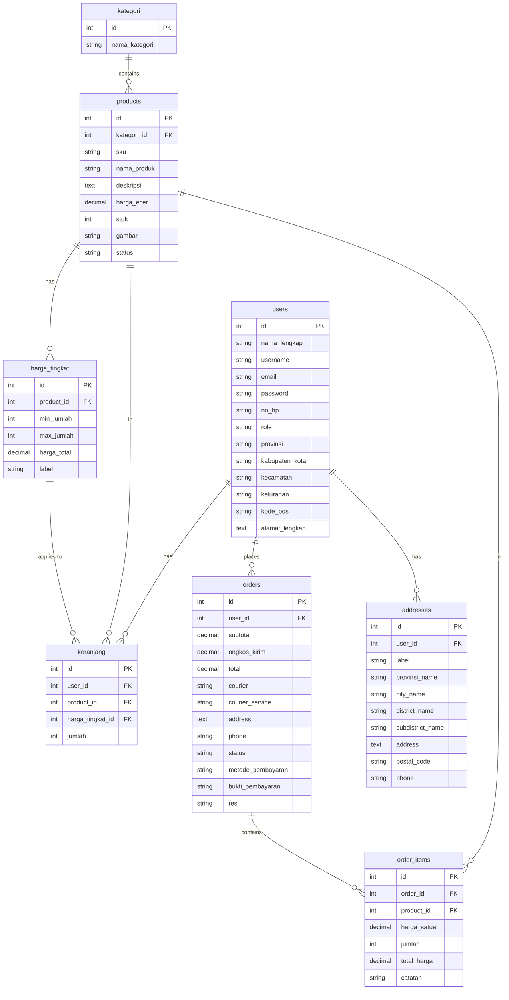
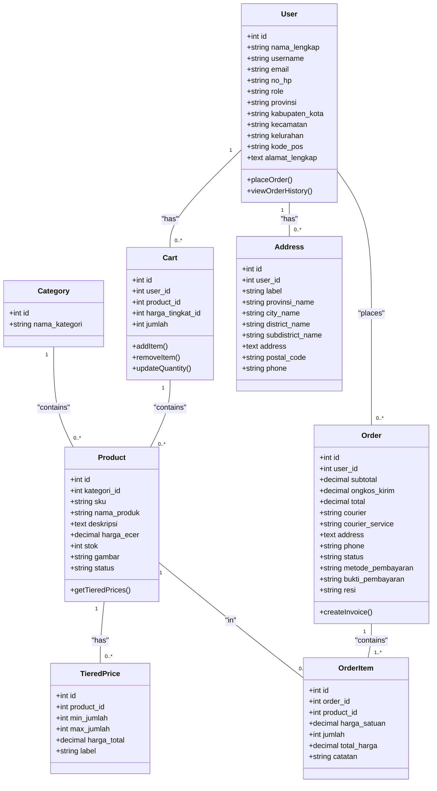

```mermaid
erDiagram
    users {
        int id PK
        string nama_lengkap
        string username
        string email
        string password
        string no_hp
        string role
        string provinsi
        string kabupaten_kota
        string kecamatan
        string kelurahan
        string kode_pos
        text alamat_lengkap
    }

    kategori {
        int id PK
        string nama_kategori
    }

    products {
        int id PK
        int kategori_id FK
        string sku
        string nama_produk
        text deskripsi
        decimal harga_ecer
        int stok
        string gambar
        string status
    }

    harga_tingkat {
        int id PK
        int product_id FK
        int min_jumlah
        int max_jumlah
        decimal harga_total
        string label
    }

    keranjang {
        int id PK
        int user_id FK
        int product_id FK
        int harga_tingkat_id FK
        int jumlah
    }

    orders {
        int id PK
        int user_id FK
        decimal subtotal
        decimal ongkos_kirim
        decimal total
        string courier
        string courier_service
        text address
        string phone
        string status
        string metode_pembayaran
        string bukti_pembayaran
        string resi
    }

    order_items {
        int id PK
        int order_id FK
        int product_id FK
        decimal harga_satuan
        int jumlah
        decimal total_harga
        string catatan
    }

    addresses {
        int id PK
        int user_id FK
        string label
        string provinsi_name
        string city_name
        string district_name
        string subdistrict_name
        text address
        string postal_code
        string phone
    }

    users ||--o{ keranjang : "has"
    users ||--o{ orders : "places"
    users ||--o{ addresses : "has"
    kategori ||--o{ products : "contains"
    products ||--o{ harga_tingkat : "has"
    products ||--o{ keranjang : "in"
    products ||--o{ order_items : "in"
    harga_tingkat ||--o{ keranjang : "applies to"
    orders ||--o{ order_items : "contains"
```

```mermaid
classDiagram
    class User {
        +int id
        +string nama_lengkap
        +string username
        +string email
        +string no_hp
        +string role
        +string provinsi
        +string kabupaten_kota
        +string kecamatan
        +string kelurahan
        +string kode_pos
        +text alamat_lengkap
        +placeOrder()
        +viewOrderHistory()
    }

    class Category {
        +int id
        +string nama_kategori
    }

    class Product {
        +int id
        +int kategori_id
        +string sku
        +string nama_produk
        +text deskripsi
        +decimal harga_ecer
        +int stok
        +string gambar
        +string status
        +getTieredPrices()
    }

    class TieredPrice {
        +int id
        +int product_id
        +int min_jumlah
        +int max_jumlah
        +decimal harga_total
        +string label
    }

    class Cart {
        +int id
        +int user_id
        +int product_id
        +int harga_tingkat_id
        +int jumlah
        +addItem()
        +removeItem()
        +updateQuantity()
    }

    class Order {
        +int id
        +int user_id
        +decimal subtotal
        +decimal ongkos_kirim
        +decimal total
        +string courier
        +string courier_service
        +text address
        +string phone
        +string status
        +string metode_pembayaran
        +string bukti_pembayaran
        +string resi
        +createInvoice()
    }

    class OrderItem {
        +int id
        +int order_id
        +int product_id
        +decimal harga_satuan
        +int jumlah
        +decimal total_harga
        +string catatan
    }

    class Address {
        +int id
        +int user_id
        +string label
        +string provinsi_name
        +string city_name
        +string district_name
        +string subdistrict_name
        +text address
        +string postal_code
        +string phone
    }

    User "1" -- "0..*" Cart : "has"
    User "1" -- "0..*" Order : "places"
    User "1" -- "0..*" Address : "has"
    Category "1" -- "0..*" Product : "contains"
    Product "1" -- "0..*" TieredPrice : "has"
    Product "1" -- "0..*" OrderItem : "in"
    Cart "1" -- "0..*" Product : "contains"
    Order "1" -- "1..*" OrderItem : "contains"
```
